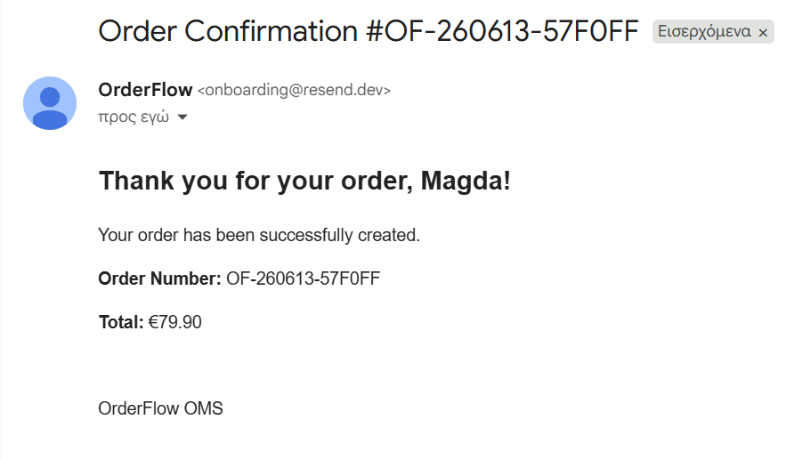

# OrderFlow | Storefront & Order Management System


A modern full-stack eCommerce Storefront and Order Management System (OMS) built with React, TypeScript and Supabase.

OrderFlow combines a customer-facing storefront with a professional operations dashboard inspired by modern commerce platforms such as Shopify and Salesforce OMS.

---

## Live Demo

https://orderflow-db-full.vercel.app/

---

## Overview

OrderFlow was designed to simulate a real-world eCommerce operations environment.

The platform provides both:

- A customer-facing storefront
- A professional Order Management System (OMS)

The goal of the project is to demonstrate modern frontend architecture, order lifecycle management, inventory operations, returns processing, customer management and real-world business workflows.

---

## Key Features

### Storefront

- Product catalog
- Product detail modal
- Shopping cart
- Checkout process
- Discount code support
- Real-time inventory visibility
- Automated order confirmation emails
- Responsive user interface

### OMS Admin

- Dashboard analytics
- Order management
- Inventory management
- Customer management
- Returns management
- Discount management
- Audit logs
- Real-time order updates

### Inventory Management

- Create new SKUs
- Stock adjustments
- Product activation
- Product archiving
- Storefront visibility control
- Low stock monitoring

### Returns & Refunds

- Return requests
- Return approval workflow
- Return received processing
- Refund handling
- Revenue adjustments
- Inventory restoration

### Integrations

- Resend transactional emails
- Vercel Serverless Functions
- Supabase Realtime
- PostgreSQL database

---

## Order Lifecycle

```text
PAID
↓
PROCESSING
↓
PACKED
↓
SHIPPED
↓
DELIVERED
```

Returns workflow:

```text
DELIVERED
↓
RETURN_REQUESTED
↓
RETURN_APPROVED
↓
RETURN_RECEIVED
↓
REFUNDED
```

---

## Screenshots

### Order Management System

<table>
<tr>
<td>

</td>
<td>

</td>
  <td>

</td>
</tr>

<tr>
<td align="center"><b>Dashboard</b></td>
<td align="center"><b>Orders</b></td>
  <td align="center"><b>Order Details</b></td>
</tr>


</table>

### Operations & Inventory

<table>
<tr>
<td>

</td>
<td>

</td>
</tr>

<tr>
<td align="center"><b>Inventory Management</b></td>
<td align="center"><b>Returns Management</b></td>
</tr>
</table>

### Customer Experience

<table>
<tr>
<td>

</td>
<td>

</td>
</tr>

<tr>
<td align="center"><b>Storefront</b></td>
<td align="center"><b>Product Details</b></td>
</tr>

<tr>
<td>

</td>
<td></td>
</tr>

<tr>
<td align="center"><b>Checkout Process</b></td>
<td align="center"><b>Order Confirmation Email</b></td>
</tr>
</table>

--

## Technology Stack

### Frontend

- React
- TypeScript
- Vite
- React Router
- Recharts
- Lucide React

### Backend

- Supabase
- PostgreSQL
- Realtime Subscriptions
- Row Level Security (RLS)

### Infrastructure & Integrations

- Vercel
- Serverless Functions
- Resend

---

## Routes

| Route | Description |
|--------|-------------|
| / | Storefront |
| /admin | OMS Dashboard |
| /admin/orders | Orders |
| /admin/customers | Customers |
| /admin/inventory | Inventory |
| /admin/returns | Returns |
| /admin/discounts | Discounts |
| /admin/audit | Audit Logs |
| /admin/orders/:id | Order Details |

---

## Installation

### Clone Repository

```bash
git clone https://github.com/vtmag/orderflow-db-full.git
cd orderflow-db-full
```

### Install Dependencies

```bash
npm install
```

### Configure Environment Variables

Create a `.env.local` file:

```env
VITE_SUPABASE_URL=your_supabase_url
VITE_SUPABASE_ANON_KEY=your_supabase_anon_key
RESEND_API_KEY=your_resend_api_key
```

### Database Setup

Run the SQL script located in:

```text
supabase/schema.sql
```

using the Supabase SQL Editor.

### Start Development Server

```bash
npm run dev
```

Application URLs:

```text
Storefront:
http://localhost:5173

Admin:
http://localhost:5173/admin
```

### Production Build

```bash
npm run build
```

### Preview Production Build

```bash
npm run preview
```

---

## Security

Current implementation includes:

- Environment variable management
- Secure server-side API integrations
- Vercel Serverless Functions
- Supabase RLS support

Future production implementation should include:

- Authentication
- User sessions
- Role-based access control

---

## Future Enhancements

- Payment gateway integration
- Shipment tracking integrations
- Multi-warehouse inventory
- Vendor management
- Advanced analytics
- ERP integrations

---

## Project Structure

```text
src/
├── components/
├── lib/
├── utils/
├── App.tsx
├── main.tsx
├── styles.css
└── types.ts

api/
└── send-order-email.js

supabase/
└── schema.sql
```

---

## Author

**Magdalini Vitsioti**

---

## License

MIT License
